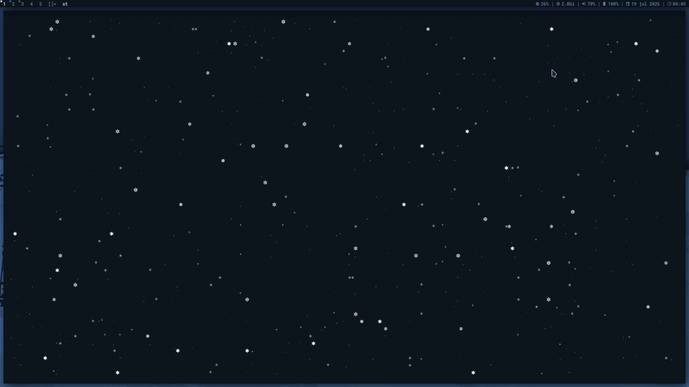
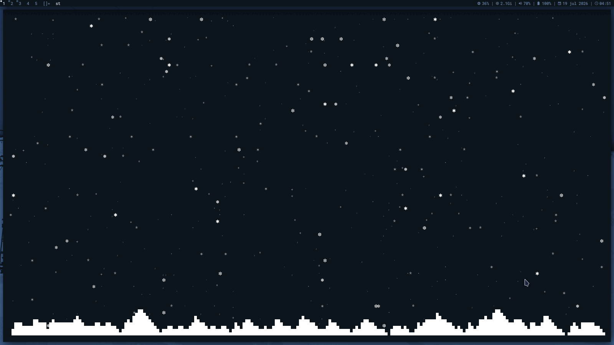

# ❄️ snowtrix

Honestly, it is just another terminal screensaver inspired by `cmatrix`, but with snow. It is a lightweight, interactive particle engine built in C99 using `termbox2`.

This is **not** a serious scientific simulation. The physics are completely faked just to look good enough for a terminal window. It is meant to be a cozy desktop companion for when you want to look busy while watching digital snow fall.

---

## ❄️ Features

* **Fake Physics:** Snowflakes fall, flutter dynamically, and accumulate at the bottom.
* **Mouse Interaction:** You can move your mouse to repel snowflakes or click to dig through the snow pile.
* **Parallax Layers:** Three depth layers (foreground, middle, background) to give a subtle 3D feel.
* **Party Mode:** A toggleable RGB mode if you get tired of the cozy white snow.
* **Zero Bloat:** Pure C99, POSIX compatible, and no heavy external assets.

---

## 📸 Showcase

| Dynamic Snowfall | Interactive Physics |
|:----------------:|:-------------------:|
|  |  |

---

## 🧰 Requirements

* Linux / POSIX system
* GCC or Clang (C99 support)
* GNU Make
* `ncursesw` and `libm`

*Note: `termbox2` is already bundled inside the project.*

---

## 🚀 Quick Start

Clone and build:

```bash
git clone https://github.com/opendoto/snowtrix.git
cd snowtrix
make
```

Run it:

```bash
./snowtrix
```

Other commands:

```bash
sudo make install    # Install system-wide
sudo make uninstall  # Remove it
make clean           # Clean build files
```

---

## ⚙️ Command Line Options

```text
-a           Enable snow accumulation on startup.
-p           Start directly in Party Mode 🌈.
-c <RRGGBB>  Set foreground snow color.
-m <RRGGBB>  Set middle layer color.
-f <RRGGBB>  Set background layer color.
-C <theme>   Use a predefined color theme.
-s <speed>   Set initial falling speed.
-w <wind>    Set initial wind force.
-b <flakes>  Set max number of active snowflakes.
-h, --help   Display help message.
```

---

## ⌨️ Runtime Controls

### General

| Key | Action |
| --- | --- |
| `q` / `ESC` | Quit |
| `a` | Toggle snow accumulation |
| `s` | Toggle Spring Mode (automatic melting) |
| `p` | Toggle Party Mode |

### Environment

| Key | Action |
| --- | --- |
| `>` / `.` | Increase wind to the right |
| `<` / `,` | Increase wind to the left |
| `w` | Calm the wind |
| `+` / `=` | Increase falling speed |
| `-` / `_` | Decrease falling speed |
| `m` | Add 50 snowflakes |
| `l` | Remove 50 snowflakes |

### Color Presets

| Key | Color | Key | Color |
| --- | --- | --- | --- |
| `!` | Red | `%` | Magenta |
| `@` | Green | `^` | Cyan |
| `#` | Yellow | `&` | White |
| `$` | Blue | `)` | Dark Gray |

---

## 🤖 AI Assistance Disclosure

### Ethical Statement

This project was developed with the assistance of an Artificial Intelligence (LLM) collaborator. Out of transparency and open-source engineering ethics, I want to explicitly state that while the core concept, feature direction, and debugging verification were driven by a human developer, a significant portion of the code structure, formatting, and performance optimization was generated using AI tools.

---

## 📜 License

This project is released under the MIT License. See the `LICENSE` file for details.
